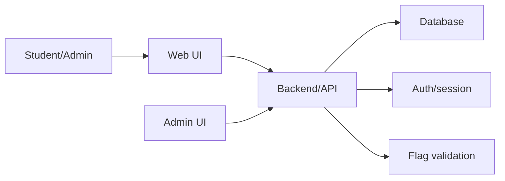

# Architecture

## Product Type

CyberEdu KZ is a learning platform with gamified cybersecurity challenges.

## MVP Architecture

## Recommended Technical Decisions

| Area | Decision | Reason |
|---|---|---|
| App framework | Next.js or React + Node API | Fast MVP development and familiar routing |
| Database | SQLite locally, PostgreSQL later | SQLite is fastest for solo demo work |
| ORM | Prisma | Clear schema and migrations |
| Auth | Email/password with hashed password | Simple and demonstrable |
| Flags | Server-side validation with stored hash | Prevents exposing answers in frontend |
| Content | Markdown-like lesson body | Easy to author and edit |
| Admin | Minimal CRUD forms | Enough for demo without building a full CMS |

## Security Notes

- Never expose valid flags in frontend code.
- Store password hashes, not passwords.
- Use role checks for admin endpoints.
- Validate user input on the server.
- Keep training tasks educational and isolated from real targets.

## Core Modules

- Auth
- Users and profile
- Courses
- Modules and lessons
- Challenges
- Submissions
- Progress
- Leaderboard
- Admin content

